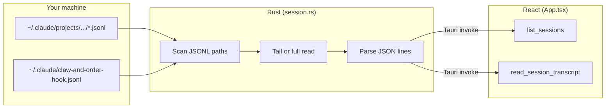

# How this app pulls in Claude session data

**Claw & Order** does **not** stream data from Anthropic’s servers or from the Claude Desktop app. It only reads **local files** that **Claude Code** (CLI / IDE integrations) writes under your home directory.

## End-to-end flow

When anything under `~/.claude/` changes on disk, a filesystem watcher emits `sessions-changed` so the UI can **reload** the list without polling.

## 1. Where sessions live on disk

Claude Code stores transcripts as **JSON Lines** (one JSON object per line):

| Path pattern | Contents |
|--------------|----------|
| `~/.claude/projects/<project-key>/*.jsonl` | Session logs for that project |
| `~/.claude/projects/<project-key>/sessions/*.jsonl` | Same, in a `sessions` subfolder |

The app discovers every `*.jsonl` in those trees via `enumerate_session_files` in `src-tauri/src/session.rs`. The projects root is `~/.claude/projects` from `claude_projects_dir()`.

## 2. How each session is identified

The **session id** is the JSONL filename **without** `.jsonl` (see `session_id_from_path` in `session.rs`). One file corresponds to one row in the sidebar.

## 3. Reading file contents (two strategies)

**Sidebar (session list):** For each file, Rust opens the file and reads only the **last ~192 KiB** (`TAIL_BYTES` in `session.rs`). That tail is enough to parse recent events, derive a rough **busy / idle / completed** state, and pick a **title** from the first real user message—without reading huge logs end to end.

**Detail pane (transcript):** When you select a session, the UI calls `read_session_transcript` with the file path. Rust reads the **entire file** up to a **15 MiB** cap (`READ_FULL_MAX_BYTES`). Larger files fail with an error instead of loading.

Both paths use `parse_jsonl_lines`: split on newlines, `serde_json::from_str` per non-empty line, skip invalid JSON.

## 4. Optional hook sidecar

Independently of the JSONL transcripts, the app may read:

`~/.claude/claw-and-order-hook.jsonl`

Each line should be JSON with at least `sessionId` and optionally `needsInput`. The **latest line per session id** wins (`load_hook_hints`). That merges into each `SessionSummary` so the UI can flag “needs your attention” when a hook reports that the user must approve something or answer a prompt.

## 5. Keeping the UI up to date

On startup, `spawn_watcher` (in `session.rs`) watches **`~/.claude` recursively** with debounced `notify` events. When something changes, the backend emits the Tauri event **`sessions-changed`**. `App.tsx` listens and invokes `list_sessions` again (and refreshes the open transcript when appropriate).

## 6. Bridge from Rust to the webview

Tauri commands are registered in `src-tauri/src/lib.rs`:

- **`list_sessions`** — scans projects, builds summaries (tail + parse + hooks).
- **`read_session_transcript`** — full capped read + parse for the main pane.
- **`get_projects_root`** — exposes the resolved projects directory string.

The React app loads data with `invoke("list_sessions")` and `invoke("read_session_transcript", { path })`.

---

For **how busy/idle is inferred** from JSON record types, optional stack notes, and a wider file map, see **`HOW_IT_WORKS.md`**.
